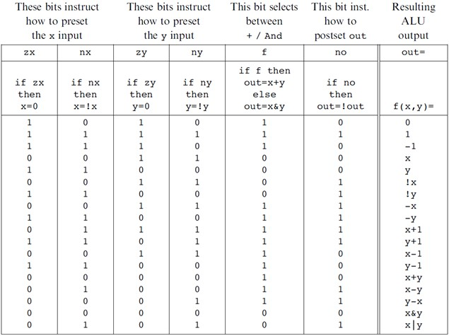
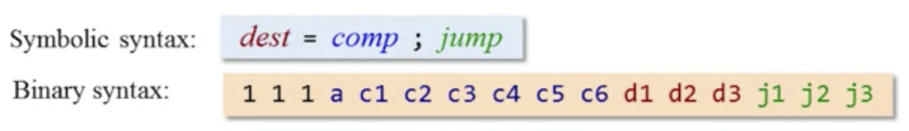
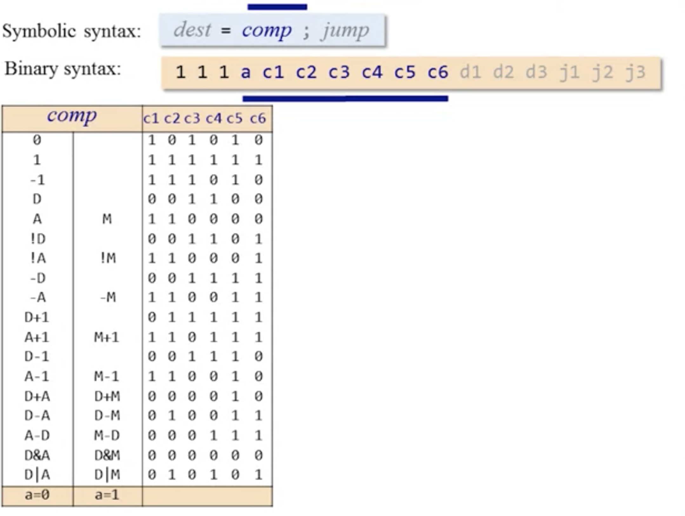
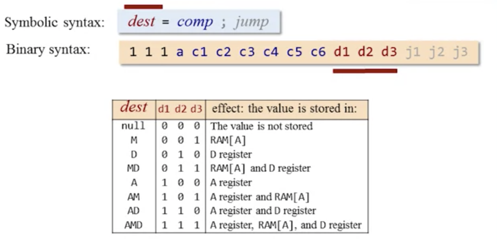
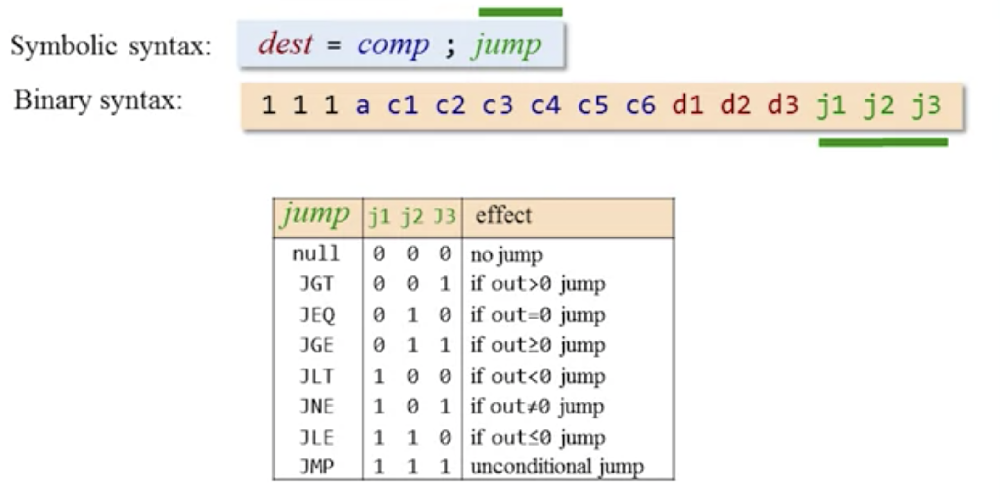
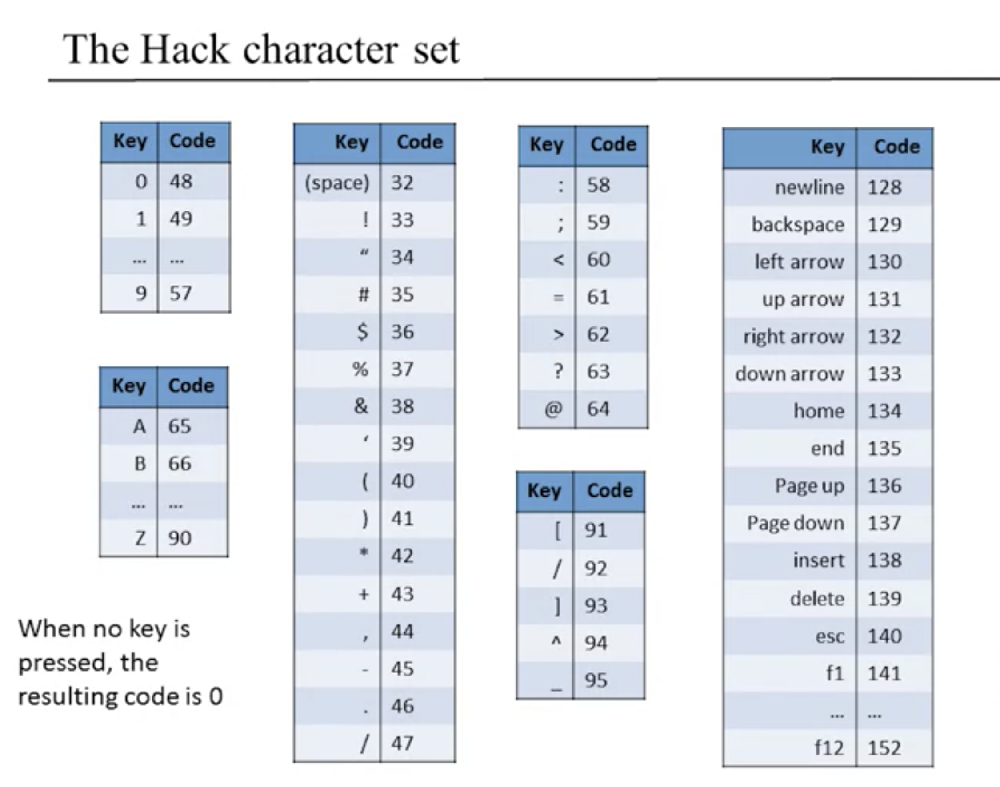
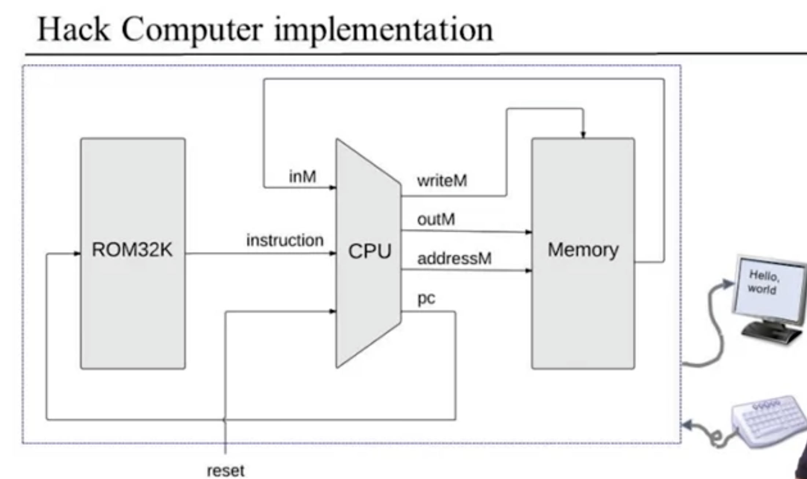
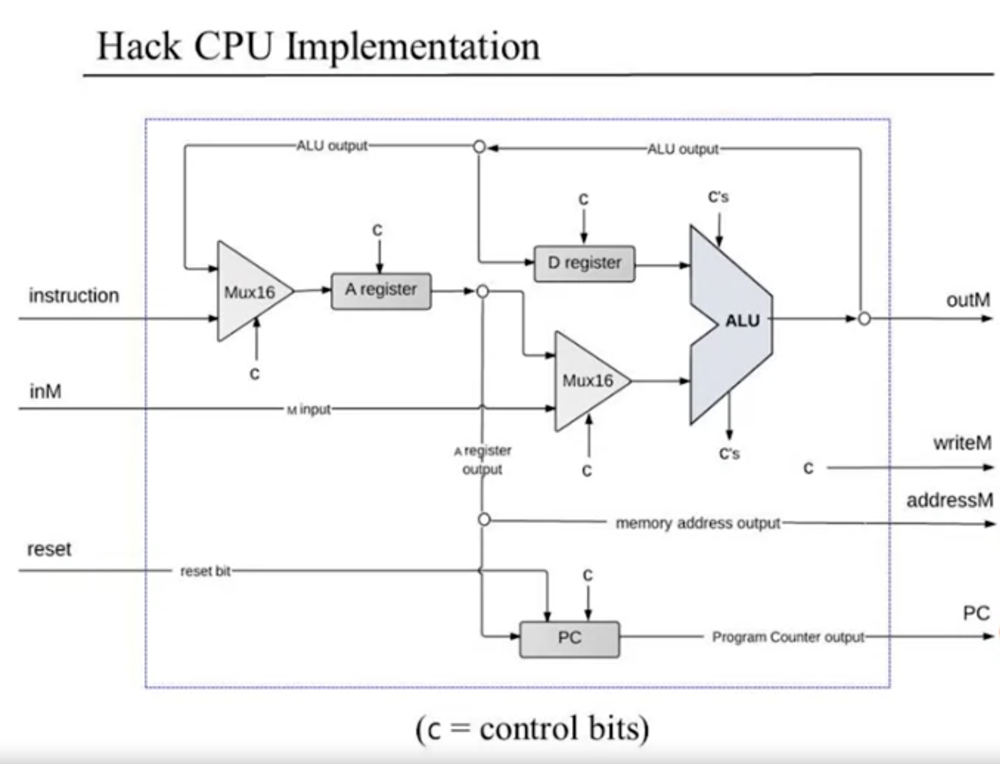

# Build a Modern Computer from First Principles (nand2tetris)

## [Course Link](https://www.coursera.org/learn/build-a-computer)

## Notes

### Hack ALU Tabe

### The C-Instruction: symbolic and binary syntax

### Hack Character Set

### Extra Resources

